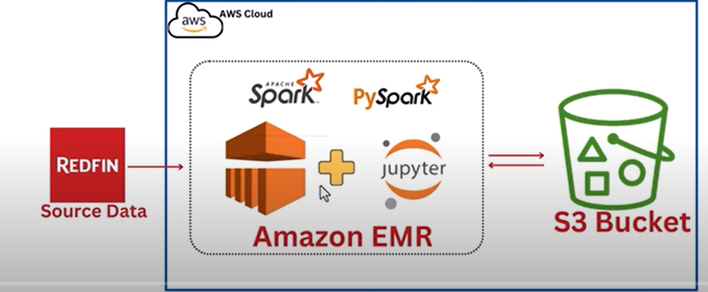

# Redfin-ETL-Pipeline
In this project we will be creating an ETL - Extract Transform & Load pipeline using the Redfin Data.
We will create a VPC and then spin AWS EMR cluster within this VPC . We will attach jupyter notebook to the provisioned EMR cluster .We will use Pyspark on Jupyter notebook attcahed to provisioned EMR to to extract data from the Redfin data source, process it and load the transformed data as parquet file into an S3 bucket.

# Techstack used 
 - AWS S3
 - AWS EMR
 - Pyspark

# Project Architecture

# Steps Followed
    1. Create AWS SECRET credentials in IAM
    2. Create two S3 buckets
        - store-raw-data-redfin-yml
        - redfin-transformed-zone
    3. Create a VPC - redfin-emr-vpc
    4. Create EMR cluster with following components installed ::
        - Pyspark
        - JupyterEnterpriseGateway
        - Zeppelin
        - EMR cluster configuration - EMR-managed scaling , minclustersize-3, maxclustersize-10, maxcorenodes-8, ec2 config - m5.xlarge
    5. Create a EMR studio with IAM permission to S3 buckets - redfin_studio
    6. Create a new workpace using the already created EMR studio. - redfin_emr_workspace
    7. After the workspace has been created, launch the workspace which will create a jupyter notebook (Disable the pop-up blocker in the browswer before executing this step)
    8. Write pyspark transformatiom jobs to transform the file and load it back to s3 bucket
    